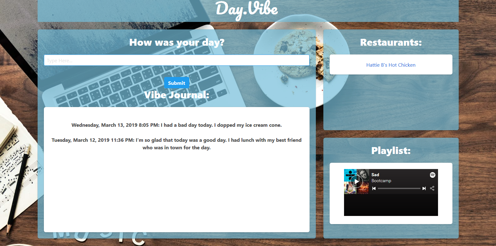

# Day Vibe

## Contributors
- lukeduran
- momack55
- kd101jp14
- rcubillo

## About
Day Vibe is an entertainment web application targeted toward teens and young adults in Nashville. Users may submit a journal entry, which is stored (by Firebase) and displayed in real time with a time stamp (using jQuery and Moment.js). From the user's input, the emotion is determined (by Parallel Dots API). Once the emotion has been determined, Day Vibe displays a Spotify playlist that is specific to that emotion. In addition, this application will suggest a nearby restaurant (with Zomato API), in case the user would like to order food or visit a local restaurant that day. By giving users a place to express themselves, listen to music, and discover local restaurants, Day Vibe is a great mood lifter for today's young population.

## Live Demo
[Visit Day Vibe here!](https://lukeduran.github.io/projectone/)

## Toolkit
HTML5, CSS3, Bulma, JavaScript, jQuery 3, Parallel Dots API, Zomato API, Spotify, Moment.js, Firebase

## Screenshot

## License

This project does not have a license and is not currently open for contributions. Suggestions are welcome.

## Contact
<!-- INCLUDE MEMBER EMAILS HERE -->
davis.kyra@rocketmail.com
